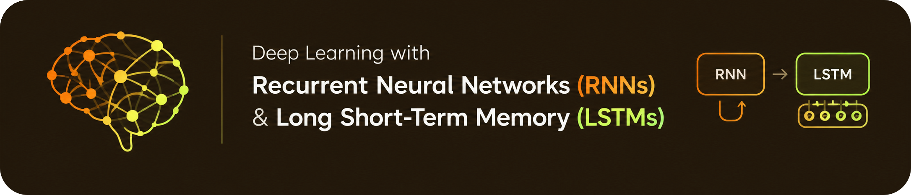
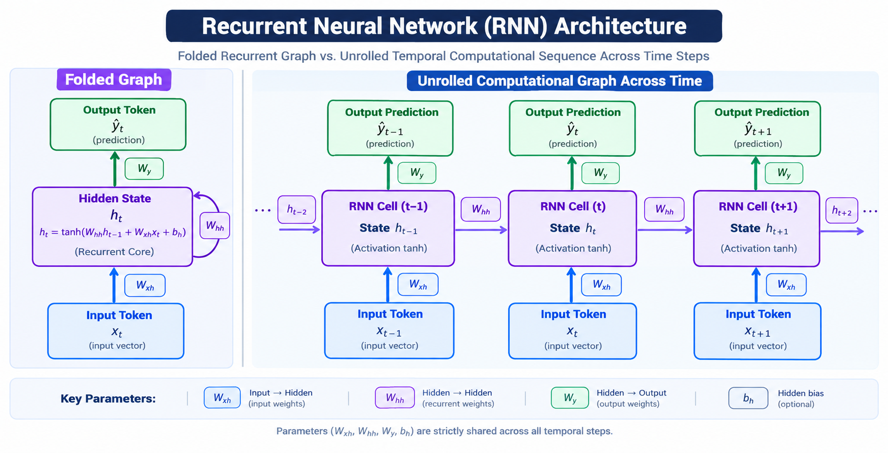
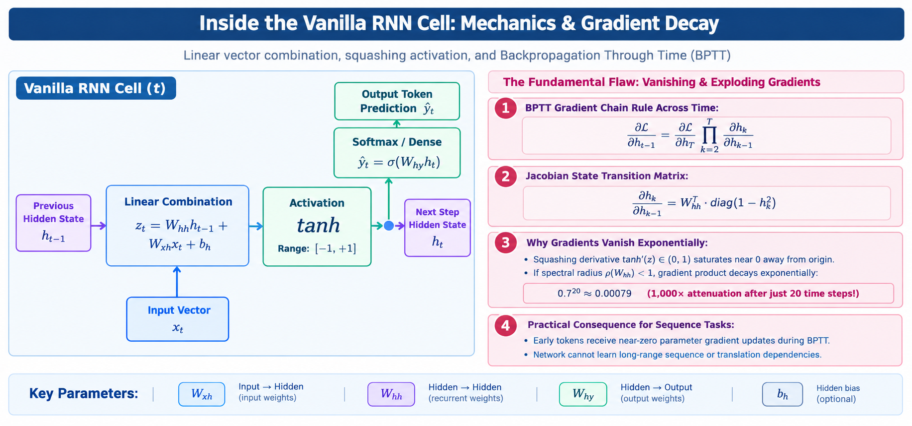
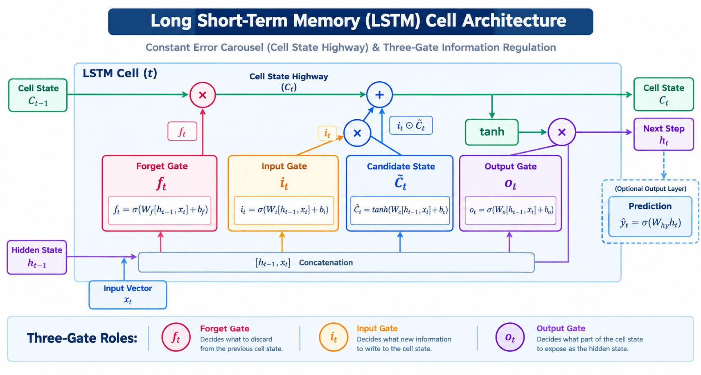
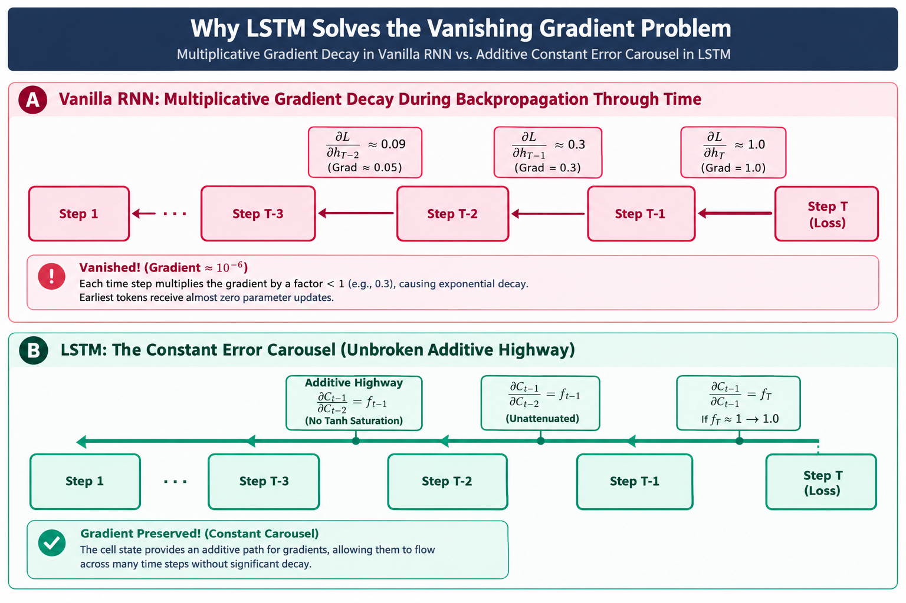
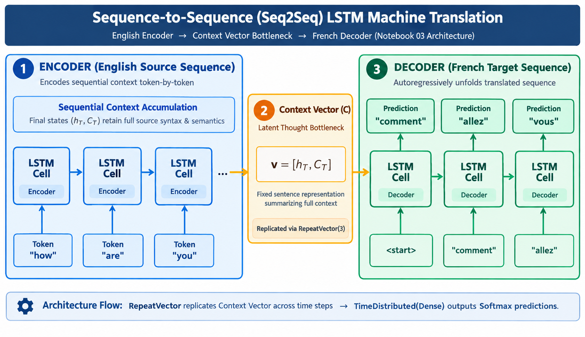

# Deep Learning with Recurrent Neural Networks (RNNs) & Long Short-Term Memory (LSTMs)

<div align="center">



<br/>
<br/>

[](https://www.python.org/)
[](https://tensorflow.org/)
[](https://pytorch.org/)
[](https://numpy.org/)
[](https://jupyter.org/)

[](LICENSE)
[](https://github.com/mohd-faizy/20P_Deep-Learning-RNNs-and-LSTMs/stargazers)
[](https://github.com/mohd-faizy/20P_Deep-Learning-RNNs-and-LSTMs/network/members)
[](https://github.com/mohd-faizy/20P_Deep-Learning-RNNs-and-LSTMs/pulls)

</div>

A rigorous, end-to-end repository exploring **Sequential Deep Learning**, from mathematical foundations and pure **NumPy / PyTorch / TensorFlow** scratch implementations to practical real-world applications in **Character-level Arithmetic Modeling** and **Sequence-to-Sequence (Seq2Seq) Machine Translation (English to French)**.

---

## Table of Contents
1. [Overview & Highlights](#overview--highlights)
2. [Recurrent Neural Networks (RNNs)](#recurrent-neural-networks-rnns)
   - [Motivation & Core Intuition](#motivation--core-intuition)
   - [Folded vs. Unrolled Representation](#folded-vs-unrolled-representation)
   - [Inside the Vanilla RNN Cell](#inside-the-vanilla-rnn-cell)
   - [Mathematical Formulation & Weight Sharing](#mathematical-formulation--weight-sharing)
   - [The Vanishing & Exploding Gradient Problem](#the-vanishing--exploding-gradient-problem)
3. [Long Short-Term Memory (LSTM) Networks](#long-short-term-memory-lstm-networks)
   - [Why LSTM? The Constant Error Carousel](#why-lstm-the-constant-error-carousel)
   - [Pristine LSTM Cell Architecture](#pristine-lstm-cell-architecture)
   - [The 3-Gate Mechanism In-Depth](#the-3-gate-mechanism-in-depth)
   - [Gradient Highway: RNN vs. LSTM Comparison](#gradient-highway-rnn-vs-lstm-comparison)
4. [Sequence-to-Sequence (Seq2Seq) Machine Translation](#sequence-to-sequence-seq2seq-machine-translation)
   - [Encoder-Decoder Architecture](#encoder-decoder-architecture)
   - [Context Thought Vector & RepeatVector Mechanics](#context-thought-vector--repeatvector-mechanics)
5. [Repository Structure & Notebook Walkthrough](#repository-structure--notebook-walkthrough)
6. [Comparative Architecture Matrix](#comparative-architecture-matrix)
7. [Installation & Quickstart](#installation--quickstart)
8. [License & Citation](#license--citation)

---

## Overview & Highlights

- **From-Scratch Mathematical Derivations**: Step-by-step vector formulations implemented in pure NumPy, TensorFlow custom sub-classed cells, and PyTorch `nn.Module`.
- **Character-Level Sequence Learning**: Teaching neural networks arithmetic logic (addition and subtraction) as sequence translation problems without explicit arithmetic rules.
- **Industrial Seq2Seq Translation**: Full translation pipeline from raw French and English corpora, tokenization, sequence padding, one-hot tensor encoding, to encoder-decoder training and evaluation.
- **Architectural Visualizations**: Vector-grade, color-coded diagnostic diagrams illustrating internal cell dynamics, gate operations, and backward temporal gradient flow.
- **Dual-Framework Mastery**: Side-by-side implementations in both **PyTorch** and **TensorFlow 2.x**.

---

## Recurrent Neural Networks (RNNs)

### Motivation & Core Intuition
Traditional Feedforward Neural Networks (MLPs, CNNs) operate under the assumption that all inputs $x_1, x_2, \dots, x_T$ are independent of one another. However, sequential data—such as natural language, time-series measurements, DNA sequences, and audio streams—inherently exhibits **temporal dependence**. The meaning of word $x_t$ is strictly constrained by the context of preceding tokens $x_1, \dots, x_{t-1}$.

Recurrent Neural Networks address this by maintaining an internal **hidden state vector** ($h_t$), acting as the model's memory of past information.

### Folded vs. Unrolled Representation
An RNN can be visualized in two ways:
1. **Folded (Compact) View**: A single cell possessing a self-directed recurrent connection that loops over time.
2. **Unrolled View**: The exact computational graph expanded across discrete temporal steps $t-1, t, t+1$.



### Inside the Vanilla RNN Cell
At every time step $t$, the RNN cell receives two vectors:
1. The current input token $x_t \in \mathbb{R}^{d_{in}}$
2. The previous hidden state $h_{t-1} \in \mathbb{R}^{d_h}$

These vectors are linearly transformed by weight matrices, summed with a bias, and squashed through a hyperbolic tangent ($\tanh$) non-linearity to bound activations within the range $[-1, 1]$.



### Mathematical Formulation & Weight Sharing
The forward recurrence is governed by the following equations:

$$h_t = \tanh\left(W_{hh} h_{t-1} + W_{xh} x_t + b_h\right)$$

$$\hat{y}_t = \text{softmax}\left(W_{hy} h_t + b_y\right)$$

Where:
- $W_{xh} \in \mathbb{R}^{d_h \times d_{in}}$: Input-to-hidden projection matrix.
- $W_{hh} \in \mathbb{R}^{d_h \times d_h}$: Recurrent hidden-to-hidden transition matrix.
- $W_{hy} \in \mathbb{R}^{d_{out} \times d_h}$: Hidden-to-output emission matrix.
- $b_h \in \mathbb{R}^{d_h}$ and $b_y \in \mathbb{R}^{d_{out}}$: Learnable bias vectors.

> **Crucial Invariance — Parameter Sharing**: The identical weight matrices $\{W_{xh}, W_{hh}, W_{hy}\}$ are reused across every temporal position. This parameter sharing enables the network to generalize to arbitrary sequence lengths while keeping parameter count independent of input duration.

---

### The Vanishing & Exploding Gradient Problem
Training RNNs relies on **Backpropagation Through Time (BPTT)**. When computing the gradient of the loss $\mathcal{L}$ at step $T$ with respect to the hidden state at an early step $k$ ($k \ll T$):

$$\frac{\partial \mathcal{L}}{\partial h_k} = \frac{\partial \mathcal{L}}{\partial h_T} \prod_{j=k+1}^T \frac{\partial h_j}{\partial h_{j-1}}$$

The temporal Jacobian matrix is:

$$\frac{\partial h_j}{\partial h_{j-1}} = W_{hh}^T \cdot \text{diag}\left(1 - h_j^2\right)$$

Because $\tanh'(z) = 1 - \tanh^2(z) \in (0, 1]$:
- If the largest eigenvalue (spectral radius) of $W_{hh}$ satisfies $\rho(W_{hh}) < 1$, the continuous matrix multiplication contracts the gradient exponentially:
  
  $$\lim_{T-k \to \infty} \left\|\prod_{j=k+1}^T \frac{\partial h_j}{\partial h_{j-1}}\right\| \to 0$$

- As a result, gradients vanishingly decay after $10-15$ steps, preventing Vanilla RNNs from retaining long-term context (e.g., matching plural subjects to verbs separated by long clauses).
- Conversely, if $\rho(W_{hh}) > 1$, gradients explode exponentially ($\to \infty$), causing numerical instability (`NaN` losses), which must be combated with gradient clipping.

---

## Long Short-Term Memory (LSTM) Networks

Introduced by **Sepp Hochreiter & Jürgen Schmidhuber (1997)**, the Long Short-Term Memory (LSTM) architecture fundamentally eliminates the vanishing gradient problem through a dedicated memory conduit called the **Cell State** ($C_t$) regulated by **three specialized multiplicative gating mechanisms**.

### Why LSTM? The Constant Error Carousel
Instead of forcing all memory to pass through saturating $\tanh$ matrix squashing at every time step, the LSTM introduces a linear **additive conveyor belt**:

$$C_t = f_t \odot C_{t-1} + i_t \odot \tilde{C}_t$$

By separating **long-term memory** ($C_t$) from **short-term working memory** ($h_t$), the network maintains a "gradient highway" where error signals propagate across hundreds of time steps without continuous exponential attenuation.

### Pristine LSTM Cell Architecture



---

### The 3-Gate Mechanism In-Depth

An LSTM cell executes four distinct computational stages at each time step $t$, taking the concatenated vector $[h_{t-1}, x_t]$:

```
                  +-------------------------------------------------------------+
                  |                      LSTM CELL DYNAMICS                     |
                  +-------------------------------------------------------------+
Previous States   |  h_{t-1} (Short-term memory)   &   C_{t-1} (Long-term memory)
Inputs            |  x_t     (Current token vector)
                  +-------------------------------------------------------------+
                  |  1. FORGET GATE:        f_t = σ(W_f · [h_{t-1}, x_t] + b_f)  |
                  |  2. INPUT GATE:         i_t = σ(W_i · [h_{t-1}, x_t] + b_i)  |
                  |  3. CANDIDATE STATE:    C~_t = tanh(W_c · [h_{t-1}, x_t] + b_c)
                  |  4. CELL STATE UPDATE:  C_t = (f_t ⊙ C_{t-1}) + (i_t ⊙ C~_t)|
                  |  5. OUTPUT GATE:        o_t = σ(W_o · [h_{t-1}, x_t] + b_o)  |
                  |  6. HIDDEN STATE:       h_t = o_t ⊙ tanh(C_t)                |
                  +-------------------------------------------------------------+
Outputs           |  h_t (to output prediction & t+1)  &  C_t (to t+1)
                  +-------------------------------------------------------------+
```

#### 1. Forget Gate ($f_t$) — Selective Erasure
Determines what fraction of the existing cell memory $C_{t-1}$ to discard:

$$f_t = \sigma\left(W_{xf} x_t + W_{hf} h_{t-1} + b_f\right)$$

- $\sigma(z) \in (0, 1)$: An activation of $0$ signifies "completely purge this information," while $1$ denotes "completely retain this information."
- *Example*: When reading a new sentence subject, the forget gate flushes the grammatical gender/number of the prior subject.

#### 2. Input Gate ($i_t$) & Candidate Cell State ($\tilde{C}_t$) — Selective Storage
Controls what new information to incorporate into the cell state:
- **Input Gate**: Decides *which coordinates* of the state to update:
  
  $$i_t = \sigma\left(W_{xi} x_t + W_{hi} h_{t-1} + b_i\right)$$

- **Candidate State**: Generates the *new prospective values* bounded in $[-1, 1]$:
  
  $$\tilde{C}_t = \tanh\left(W_{xc} x_t + W_{hc} h_{t-1} + b_c\right)$$

#### 3. Cell State Update ($C_t$) — The Additive Conveyor Belt
The long-term memory is updated by element-wise linear addition ($\oplus$):

$$C_t = f_t \odot C_{t-1} + i_t \odot \tilde{C}_t$$

Notice there are **no matrix multiplications** applied to $C_{t-1}$ during this update! The old memory is simply scaled by $f_t$ and added to the gated candidate $i_t \odot \tilde{C}_t$.

#### 4. Output Gate ($o_t$) & Hidden State ($h_t$) — Filtered Emission
Controls what information from the cell state is projected to external layers and the next step:

$$o_t = \sigma\left(W_{xo} x_t + W_{ho} h_{t-1} + b_o\right)$$

$$h_t = o_t \odot \tanh\left(C_t\right)$$

The cell state is pushed through $\tanh$ to bring values into $[-1, 1]$ and scaled by the output gate $o_t$ to emit the hidden state $h_t$.

---

### Gradient Highway: RNN vs. LSTM Comparison

The fundamental advantage of LSTM over Vanilla RNN is highlighted when comparing their backward error propagation paths:



- **Vanilla RNN**:
  
  $$\frac{\partial h_T}{\partial h_1} = \prod_{k=2}^T W_{hh}^T \text{diag}(1 - h_k^2) \implies \text{Exponential contraction}$$

- **LSTM Cell State Highway**:
  
  $$\frac{\partial C_T}{\partial C_1} = \prod_{k=2}^T \left( f_k + \dots \right)$$

If the forget gate $f_k \approx 1$ (which modern initializations encourage by setting $b_f = 1.0$), the gradient flows backwards through time completely **unattenuated**, permitting gradient propagation over hundreds of sequence steps.

---

## Sequence-to-Sequence (Seq2Seq) Machine Translation

In **Notebook 03**, we implement an industrial **Sequence-to-Sequence (Seq2Seq)** Encoder-Decoder neural machine translation model translating English phrases into French using vocabulary datasets located in `data/`.



### Encoder-Decoder Architecture
A standard RNN/LSTM maps an input sequence to an output sequence of identical length. However, language translation requires mapping an input sentence of length $M$ to a target sentence of differing length $N$ ($M \neq N$), often with non-aligned word order.

1. **Encoder LSTM**:
   - Consumes English tokens: $x_1, x_2, \dots, x_M$ ("how", "are", "you").
   - Discards intermediate outputs and outputs the final hidden state $h_M$ and cell state $C_M$.
   - This final tuple forms the **Context Vector** ($C \in \mathbb{R}^{d_{latent}}$), encapsulating the semantic essence of the entire input sentence.

2. **Thought Vector Bridging (`RepeatVector`)**:
   - The context vector $C$ is broadcast/duplicated across all $N$ time steps of the target sequence length using Keras's `RepeatVector(max_french_len)`.

3. **Decoder LSTM**:
   - Accepts the repeated context vector and unfolds the French sequence step-by-step.

4. **TimeDistributed Dense Projection**:
   - A `TimeDistributed(Dense(french_vocab_size, activation='softmax'))` layer computes probability distributions over the entire French vocabulary at each output position:
     
     $$\hat{y}_t = \text{softmax}\left(W_{vocab} h_t^{dec} + b_{vocab}\right)$$

---

### Notebook Breakdown

#### [01_Simple_RNN_Arithmetic_Addition.ipynb](01_Simple_RNN_Arithmetic_Addition.ipynb)
- **Objective**: Teach an RNN to perform multi-digit integer addition ("535+84" $\rightarrow$ "619") from pure character sequences.
- **Key Techniques**:
  - Sequence inversion trick: reversing input strings significantly shortens temporal dependency for the most significant carry digits.
  - Character tokenization, one-hot sequence encoding, and zero padding.
  - Architecture: `SimpleRNN` $\rightarrow$ `RepeatVector` $\rightarrow$ `TimeDistributed(Dense)`.
  - Continuous validation on unseen addition queries.

#### [02_Simple_RNN_Arithmetic_Addition_and_Subtraction.ipynb](02_Simple_RNN_Arithmetic_Addition_and_Subtraction.ipynb)
- **Objective**: Broaden the arithmetic language model to handle multiple operators simultaneously ($+$ and $-$).
- **Key Techniques**:
  - Variable-length arithmetic syntax parsing.
  - Multi-class cross-entropy loss over the character vocabulary $\{0\dots9, +, -, \text{space}\}$.
  - Evaluation of model robustness against operator confusion and borrow/carry propagation.

#### [03_Seq2Seq_LSTM_English_to_French_Translation.ipynb](03_Seq2Seq_LSTM_English_to_French_Translation.ipynb)
- **Objective**: Build and evaluate an end-to-end Sequence-to-Sequence (Seq2Seq) neural translator from English to French.
- **Key Techniques**:
  - Text preprocessing, punctuation stripping, lowercasing, and frequency distribution analysis.
  - Keras `Tokenizer` mapping to integer sequences and `pad_sequences` normalization.
  - Encoder LSTM summarizing input sequences into a dense latent representation.
  - Decoder LSTM coupled with `TimeDistributed(Dense(softmax))` producing sequential token predictions.
  - Qualitative translation validation on custom conversational test sentences.

#### [04_RNN_From_Scratch_TensorFlow_and_PyTorch.ipynb](04_RNN_From_Scratch_TensorFlow_and_PyTorch.ipynb)
- **Objective**: Deep-dive mathematical dissection of Vanilla RNNs implemented without high-level abstractions.
- **Key Techniques**:
  - **Pure NumPy Implementation**: Manual loops over time steps, matrix multiplications, $\tanh$ forward pass, and state tracking.
  - **PyTorch Custom Module**: Subclassing `nn.Module`, managing recurrence parameters with `nn.Parameter`, and handling batch-first dimensions.
  - **TensorFlow Custom Cell**: Building a custom `tf.keras.layers.Layer` with custom weight initialization.
  - **Diagnostics**: Tracking gradient norms across sequence lengths to empirically demonstrate vanishing gradients.
  - **Interactive Learning**: Code-completion challenges and recurrence puzzles with test assertions.

#### [05_LSTM_From_Scratch_TensorFlow_and_PyTorch.ipynb](05_LSTM_From_Scratch_TensorFlow_and_PyTorch.ipynb)
- **Objective**: Implement the full LSTM tri-gate equations from scratch across three frameworks.
- **Key Techniques**:
  - **Pure NumPy LSTM**: Manual calculation of Forget Gate ($f_t$), Input Gate ($i_t$), Candidate State ($\tilde{C}_t$), Cell State ($C_t$), and Output Gate ($o_t$).
  - **PyTorch Custom LSTM**: Implementing the 4-in-1 weight matrix optimization $[W_f, W_i, W_c, W_o]$ for accelerated forward execution.
  - **TensorFlow/Keras Model**: Subclassing `tf.keras.Model` and contrasting custom cell performance against `tf.keras.layers.LSTM`.
  - **Gating Activation Inspection**: Visualizing gate saturation patterns (how the network learns to selectively remember or flush context).
  - **Memory Cell Puzzle**: Interactive problem-solving exercises validating state retention capabilities.

---

## Comparative Architecture Matrix

| Feature / Metric | Vanilla RNN | Long Short-Term Memory (LSTM) | Gated Recurrent Unit (GRU) | Transformer (Self-Attention) |
| :--- | :--- | :--- | :--- | :--- |
| **Introduced By** | Rumelhart et al. (1986) | Hochreiter & Schmidhuber (1997) | Cho et al. (2014) | Vaswani et al. (2017) |
| **Internal Memory** | Hidden State ($h_t$) only | Cell State ($C_t$) + Hidden ($h_t$) | Hidden State ($h_t$) only | Key-Value Cache / Self-Attention |
| **Number of Gates** | $0$ (No gating) | $3$ (Forget, Input, Output) | $2$ (Reset, Update) | Gated MLP / Attention weights |
| **Gradient Highway** | None ($\times W_{hh}$ every step) | **Constant Error Carousel** ($\oplus$) | Additive linear interpolation | Residual Connections ($x + f(x)$) |
| **Vanishing Gradients** | Severe (fails after $>15$ steps) | **Solved** (effective for 100+ steps) | **Solved** (comparable to LSTM) | **Solved** (scaled dot-product) |
| **Parameter Count** | $\mathcal{O}(d_h^2 + d_h d_{in})$ | $\mathbf{4 \times}$ Vanilla RNN | $\mathbf{3 \times}$ Vanilla RNN | $\mathcal{O}(d_{model}^2)$ per layer |
| **Sequential Processing** | Strictly sequential ($\mathcal{O}(T)$) | Strictly sequential ($\mathcal{O}(T)$) | Strictly sequential ($\mathcal{O}(T)$) | **Fully Parallelizable** ($\mathcal{O}(1)$ time) |
| **Best Used For** | Educational study, short signals | Long sequences, speech, audio | Resource-constrained seq tasks | Large language models, multi-modal |

---

## Installation & Quickstart

### 1. Clone the Repository
```bash
git clone https://github.com/your-username/29_RNNs_and_LSTMs.git
cd 29_RNNs_and_LSTMs
```

### 2. Create and Activate a Virtual Environment
```bash
# On Linux / macOS
python3 -m venv venv
source venv/bin/activate

# On Windows (PowerShell)
python -m venv venv
.\venv\Scripts\Activate.ps1
```

### 3. Install Dependencies
```bash
pip install -r requirements.txt
```

### 4. Launch Jupyter Lab / Notebooks
```bash
jupyter lab
```

### 5. Regenerate Diagrams (Optional)
To regenerate or customize the 300 DPI architectural diagrams:
```bash
python generate_diagrams.py
```

---

## Technical Dependencies

The repository utilizes the following core scientific computing and deep learning packages:

- **Python**: $\ge 3.8$
- **TensorFlow**: $\ge 2.12.0$ (Keras Seq2Seq & custom layers)
- **PyTorch**: $\ge 2.0.0$ (Custom `nn.Module` RNNs and LSTMs)
- **NumPy**: $\ge 1.23.0$ (Vectorized matrix operations)
- **Pandas**: $\ge 1.5.0$ (Corpus manipulation & statistics)
- **Matplotlib & Pillow**: Publication-quality diagram rendering
- **JupyterLab / Notebook**: Interactive exploratory environments

---

## License & Citation

This project is released under the [MIT License](LICENSE). Feel free to use.

---

## 🔗 Connect with Me

<div align="center">

[](https://twitter.com/F4izy)
[](https://www.linkedin.com/in/mohd-faizy/)
[](https://ai.stackexchange.com/users/36737/faizy)
[](https://github.com/mohd-faizy)

</div>